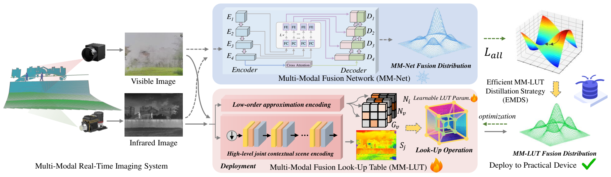

<h1 align="center">[ICCV 2025] LUT-Fuse</h1>
<p align="center">
  <em>Towards Extremely Fast Infrared and Visible Image Fusion via Distillation to Learnable Look-Up Tables</em>
</p>

<p align="center">
  <a href="https://github.com/zyb5/LUT-Fuse" style="text-decoration:none;">
    
  </a>
  <a href="https://arxiv.org/abs/2509.00346" style="text-decoration:none; margin-left:8px;">
    
  </a>
  <a href="https://huggingface.co/spaces/ZYB5/LUT-Fuse-demo" style="text-decoration:none; margin-left:8px;">
    
  </a>
</p>

<p align="center">
  
</p>

---

## ⚙️ Environment

```
conda create -n lutfuse python=3.8
conda activate lutfuse
```

```
conda install pytorch==2.0.0 torchvision==0.15.0 pytorch-cuda=11.8 -c pytorch -c nvidia
pip install -r requirements.txt
```

## 📂 Dataset

You should list your dataset as followed rule:

```
|dataset
  |train
    |Infrared
    |Visible
    |Fuse_ref
  |test
    |Infrared
    |Visible
    |Fuse_ref
```

## 💾 Checkpoints

We provide our **pretrained checkpoints** directly in this repository for convenience.  
You can find them under [`./ckpts`](./ckpts).

- **Fusion LUT weights:** `ckpts/fine_tuned_lut.npy`  
- **Context generator weights:** `ckpts/generator_context.pth`

## 🧪 Test

```
CUDA_VISIBLE_DEVICES=0 python test_lut.py
```

## 🚀 Train

```
CUDA_VISIBLE_DEVICES=0 python fine_tune_lut.py
```

## 📖 Citation

If you find our work or dataset useful for your research, please cite our paper.

```bibtex
@inproceedings{yi2025LUT-Fuse,
  title={LUT-Fuse: Towards Extremely Fast Infrared and Visible Image Fusion via Distillation to Learnable Look-Up Tables},
  author={Yi, Xunpeng and Zhang, Yibing and Xiang, Xinyu and Yan, Qinglong and Xu, Han and Ma, Jiayi},
  booktitle={Proceedings of the IEEE/CVF International Conference on Computer Vision},
  year={2025}
}
```

If you have any questions, please send an email to zhangyibing@whu.edu.cn


